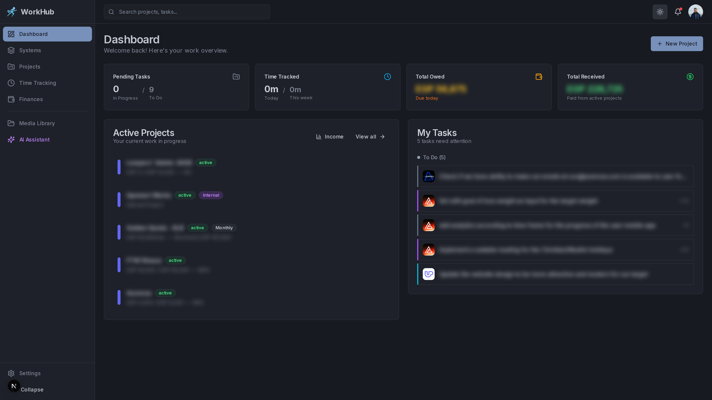
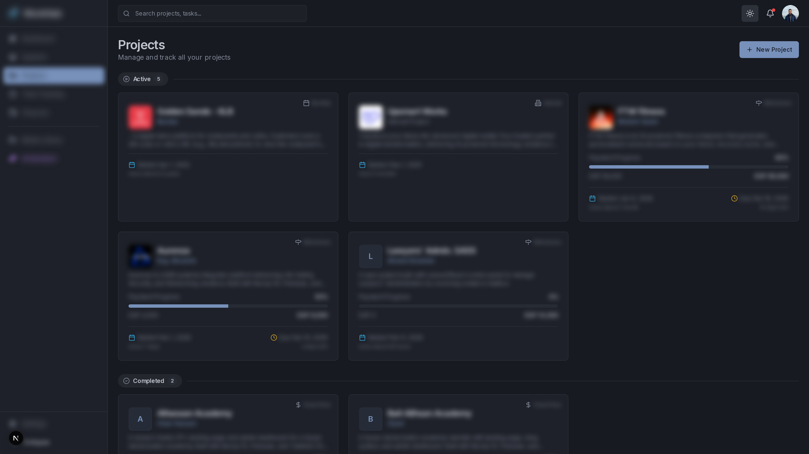
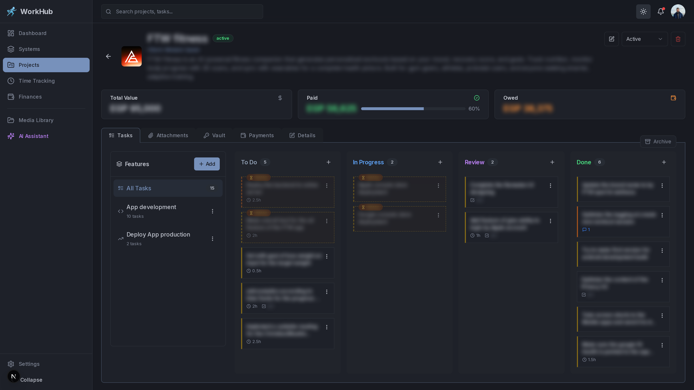
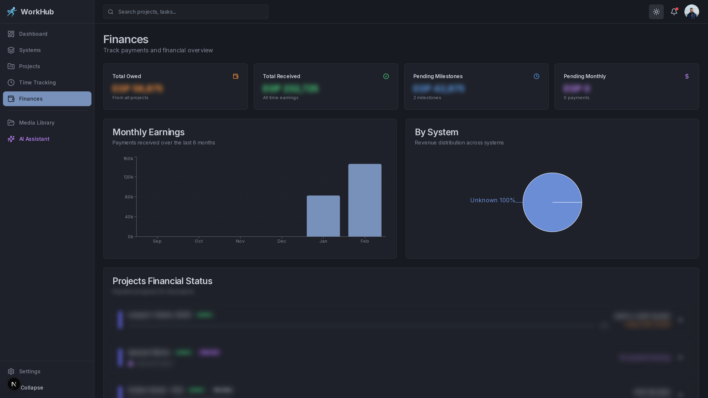
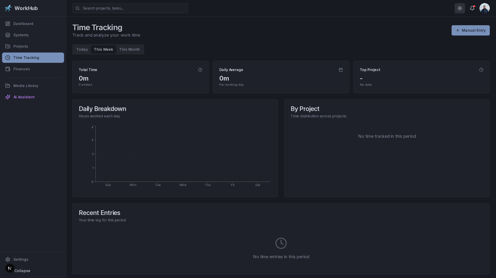
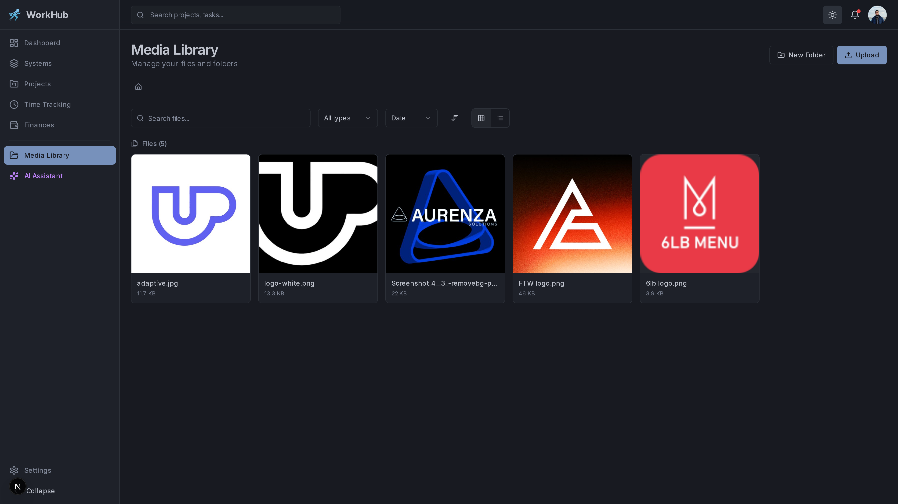
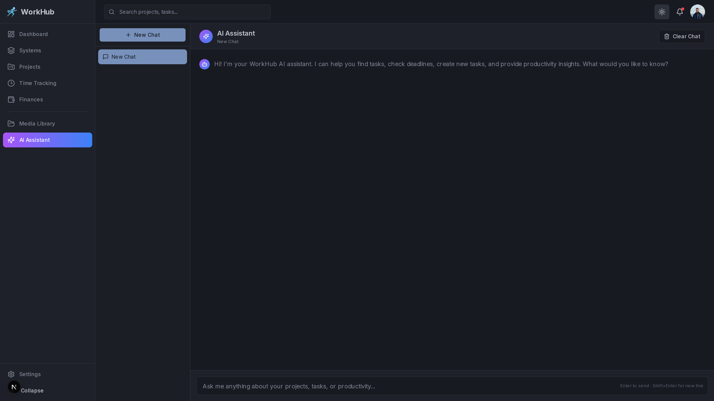

<div align="center">

# WorkHub

**A full-stack project management platform for freelancers and small teams.**

Manage projects, tasks, time tracking, finances, media assets, and more — with AI-powered assistance.

[](LICENSE)
[](https://nextjs.org/)
[](https://www.typescriptlang.org/)
[](https://firebase.google.com/)
[](https://tailwindcss.com/)
[](CONTRIBUTING.md)

[Getting Started](#getting-started) &bull; [Features](#features) &bull; [Screenshots](#screenshots) &bull; [Contributing](#contributing) &bull; [License](#license)

</div>

---

## Why WorkHub?

Most project management tools are either too simple or too bloated. WorkHub is built for **solo developers, freelancers, and small teams** who need:

- A **Kanban board** that actually feels fast (optimistic updates, drag-and-drop)
- **Time tracking** built in, not bolted on
- **Financial tracking** per project — know what you're owed at a glance
- **AI assistance** for task planning and time estimates
- **Self-hosted** with Firebase — your data stays yours

---

## Screenshots

> All screenshots show the built-in **dark mode**. Light mode is also fully supported.

### Dashboard
Your central command center — active projects, pending tasks, time tracked, and financial summary all in one view.

<p align="center">
  
</p>

### Projects
Manage all your projects with rich cards showing progress, payment models, deadlines, and client info.

<p align="center">
  
</p>

### Kanban Board
Drag-and-drop task management with color-coded priorities, task types, time estimates, and feature grouping.

<p align="center">
  
</p>

### Financial Management
Track payments, milestones, and monthly earnings with interactive charts and per-project financial status.

<p align="center">
  
</p>

### Time Tracking
Analyze your work hours with daily breakdowns, project distribution, and detailed time entry logs.

<p align="center">
  
</p>

### Media Library
Upload, organize, and link files to projects with grid/list views, filters, and automatic image optimization.

<p align="center">
  
</p>

### AI Assistant
Chat-based AI assistant powered by Google Gemini for task breakdowns, time estimates, and productivity insights.

<p align="center">
  
</p>

---

## Features

### Project Management
- **Multi-tier hierarchy**: Organizations > Systems > Projects > Features > Tasks > Subtasks
- **Kanban board** with drag-and-drop task reordering across columns (To Do, In Progress, Review, Done)
- **Task types**: Task, Bug, Feature, Improvement, Documentation, Research — each color-coded
- **Priority levels**: Low, Medium, High, Critical — with visual border indicators
- **Task states**: Archive tasks to declutter, or mark as "Waiting" for blocked/external-dependency tasks
- **Subtasks** with individual time tracking and status management
- **Comments** on both tasks and subtasks

### Time Tracking
- **Live timer widget** with start, pause, resume, and stop controls
- **Manual time entry** creation for retroactive logging
- **Per-subtask tracking** linked to projects and tasks
- **Daily and weekly summaries** on the dashboard
- **Persistent timer state** across page navigation (Zustand with localStorage)

### Financial Management
- **Payment models**: Milestone-based, Monthly, Fixed-price, and Internal projects
- **Milestone tracking** with pending/completed/paid statuses
- **Monthly payment management** with payment history
- **Income visualization** with interactive charts
- **Dashboard stats**: Total owed, total received, days until next payment deadline

### Media Library
- **File management** with folder hierarchy and breadcrumb navigation
- **Drag-and-drop upload** with progress tracking
- **Image optimization**: Automatic compression via Canvas API (configurable quality/dimensions)
- **File categories**: Images, Videos, Audio, Documents, Archives
- **Link files** to projects and tasks for organized attachments
- **50MB max file size** with Firebase Storage

### Project Vault
- **Secure storage** for project-specific sensitive data
- **Entry types**: Text notes, Passwords, and Files
- **Per-project isolation** with easy access from project detail view

### AI Assistant
- **Powered by Google Gemini** (4 model options)
- **Task breakdown**: Generate subtask suggestions from feature descriptions
- **Time estimation**: AI-powered effort estimates for tasks
- **Productivity insights**: Analyze project health and work patterns
- **General Q&A**: Ask anything in the assistant chat interface
- **Web search**: Integrated DuckDuckGo search and URL content fetching

### Dashboard
- **At-a-glance overview**: Active projects, pending tasks, time tracked, finances
- **Priority-sorted task list** filtered to actionable items (waiting/archived tasks hidden)
- **Income chart toggle** for quick financial review

### Additional
- **Dark mode** support (class-based toggle)
- **Responsive design** for desktop and mobile
- **Confetti celebration** when tasks are moved to Done
- **Optimistic UI updates** for instant feedback on all operations
- **Toast notifications** for success/error feedback

---

## Tech Stack

| Category | Technology |
|---|---|
| **Framework** | [Next.js 16](https://nextjs.org/) (App Router, Turbopack) |
| **Language** | [TypeScript 5.7](https://www.typescriptlang.org/) (strict mode) |
| **UI** | [React 19.2](https://react.dev/) |
| **Styling** | [Tailwind CSS 3.4](https://tailwindcss.com/) |
| **Components** | [Radix UI](https://www.radix-ui.com/) + [shadcn/ui](https://ui.shadcn.com/) pattern |
| **Icons** | [Lucide React](https://lucide.dev/) |
| **Charts** | [Recharts 2](https://recharts.org/) |
| **Database** | [Firebase Firestore](https://firebase.google.com/products/firestore) |
| **Auth** | [Firebase Authentication](https://firebase.google.com/products/auth) |
| **Storage** | [Firebase Storage](https://firebase.google.com/products/storage) |
| **State** | [Zustand 5](https://zustand-demo.pmnd.rs/) (timer persistence) |
| **AI** | [Google Generative AI](https://ai.google.dev/) (Gemini) |
| **Dates** | [date-fns 4](https://date-fns.org/) |

---

## Project Structure

```
workhub/
├── .github/                     # Issue templates, PR template
├── firebase/
│   ├── firestore.rules          # Firestore security rules
│   ├── firestore.indexes.json   # Composite index definitions
│   ├── storage.rules            # Storage security rules
│   └── migrations/              # Database migration scripts
├── public/                      # Static assets
├── src/
│   ├── app/
│   │   ├── (auth)/login/        # Login page
│   │   ├── (dashboard)/         # Protected routes
│   │   │   ├── page.tsx         # Dashboard home
│   │   │   ├── assistant/       # AI assistant
│   │   │   ├── finances/        # Financial management
│   │   │   ├── media/           # Media library
│   │   │   ├── projects/        # Projects + detail view
│   │   │   ├── settings/        # App settings
│   │   │   ├── systems/         # System management
│   │   │   └── time/            # Time tracking
│   │   └── api/
│   │       ├── ai/              # Gemini AI endpoint
│   │       └── web/             # Search & URL fetch
│   ├── components/
│   │   ├── ai/                  # AI suggestion components
│   │   ├── charts/              # Income & analytics charts
│   │   ├── features/            # Feature list management
│   │   ├── finances/            # Milestone & payment UI
│   │   ├── layout/              # Navbar, Sidebar, ThemeProvider
│   │   ├── media/               # Media library UI
│   │   ├── projects/            # Project tabs & image picker
│   │   ├── systems/             # System CRUD dialogs
│   │   ├── tasks/               # Kanban board, cards, detail modal
│   │   ├── time/                # Timer widget
│   │   └── ui/                  # 30+ shared UI primitives
│   ├── hooks/                   # 13 custom React hooks
│   ├── lib/                     # Firebase, Firestore, Gemini, Storage, utils
│   ├── store/                   # Zustand timer store
│   └── types/                   # TypeScript interfaces & types
├── CONTRIBUTING.md
├── LICENSE
└── README.md
```

---

## Getting Started

### Prerequisites

- **Node.js** 18 or later
- **npm** (comes with Node.js)
- A **Firebase project** with Firestore, Authentication, and Storage enabled
- A **Google AI Studio** API key (for Gemini features — optional)

### Installation

```bash
# Clone the repository
git clone https://github.com/AhmedSayedSk/workhub.git
cd workhub

# Install dependencies
npm install
```

### Environment Variables

Copy the example file and fill in your values:

```bash
cp .env.local.example .env.local
```

```env
# Firebase Configuration
NEXT_PUBLIC_FIREBASE_API_KEY=your_api_key_here
NEXT_PUBLIC_FIREBASE_AUTH_DOMAIN=your_project.firebaseapp.com
NEXT_PUBLIC_FIREBASE_PROJECT_ID=your_project_id
NEXT_PUBLIC_FIREBASE_STORAGE_BUCKET=your_project.appspot.com
NEXT_PUBLIC_FIREBASE_MESSAGING_SENDER_ID=your_sender_id
NEXT_PUBLIC_FIREBASE_APP_ID=your_app_id

# Gemini AI (optional — AI features will be disabled without this)
GEMINI_API_KEY=your_gemini_api_key_here
```

**Where to get these values:**
- **Firebase**: [Firebase Console](https://console.firebase.google.com/) > Project Settings > General > Your Apps
- **Gemini**: [Google AI Studio](https://aistudio.google.com/apikey)

### Firebase Setup

1. Create a Firebase project at [console.firebase.google.com](https://console.firebase.google.com/)
2. Enable **Firestore Database** (start in production mode)
3. Enable **Authentication** > Sign-in method > **Email/Password**
4. Enable **Storage**
5. Update `.firebaserc` with your project ID
6. Deploy security rules and indexes:

```bash
npm run firebase:deploy:rules
npm run firebase:deploy:indexes
```

7. **(Optional)** For database migrations, download a service account key from Firebase Console > Project Settings > Service Accounts > Generate New Private Key, save it as `firebase-service-account.json` in the project root, then run:

```bash
npm run migrate
```

### Running the App

```bash
# Development server (port 3090)
npm run dev

# Production build
npm run build
npm start
```

Open [http://localhost:3090](http://localhost:3090) in your browser.

---

## Available Scripts

| Command | Description |
|---|---|
| `npm run dev` | Start development server on port 3090 |
| `npm run build` | Create optimized production build |
| `npm start` | Start production server |
| `npm run lint` | Run ESLint checks |
| `npm run migrate` | Run Firestore database migrations |
| `npm run migrate:reset` | Reset the database (destructive) |
| `npm run db:clear` | Clear sample/seed data |
| `npm run firebase:deploy` | Deploy all Firebase configs |
| `npm run firebase:deploy:rules` | Deploy Firestore security rules only |
| `npm run firebase:deploy:indexes` | Deploy Firestore indexes only |

---

## Architecture

### Data Model

```
Organization
  └── System (color-coded project groups)
        └── Project (client, payment model, finances)
              ├── Feature (high-level work items)
              │     └── Task (kanban items with status, type, priority)
              │           ├── Subtask (granular work units)
              │           ├── TaskComment (discussion threads)
              │           └── TimeEntry (tracked work sessions)
              ├── Milestone (payment milestones)
              ├── MonthlyPayment (recurring payments)
              └── VaultEntry (sensitive project data)

MediaFolder / MediaFile  (global media library, linkable to projects/tasks)
AppSettings              (singleton for AI model configuration)
```

### Key Design Decisions

- **Optional boolean flags** (`archived`, `waiting`) are orthogonal to task status — tasks keep their kanban column position
- **Optimistic updates** on all CRUD operations for instant UI feedback with automatic rollback on error
- **Soft-delete via archive** — tasks can be archived and restored, or permanently deleted
- **All timestamps** use Firestore `Timestamp` for consistency

### API Routes

| Endpoint | Method | Description |
|---|---|---|
| `/api/ai` | `POST` | AI operations: task breakdown, time estimates, insights, Q&A |
| `/api/ai` | `GET` | Fetch current AI settings |
| `/api/web/search` | `POST` | DuckDuckGo web search (no API key needed) |
| `/api/web/fetch` | `POST` | Fetch and extract content from URLs |

---

## AI Integration

WorkHub integrates with **Google Gemini** for intelligent assistance:

| Feature | Description |
|---|---|
| **Task Breakdown** | Generate subtask suggestions from a feature description |
| **Time Estimation** | AI-powered effort estimates based on task details |
| **Insights** | Productivity and project health analysis |
| **Chat Assistant** | General-purpose Q&A with optional web search |

**Available models** (configurable in Settings):
- Gemini 3 Pro — Most capable, 1M token context
- Gemini 3 Flash — Recommended balance of speed and quality
- Gemini 2.5 Pro — Advanced reasoning
- Gemini 2.5 Flash — Fastest performance

AI features are **optional** and gracefully disabled when no `GEMINI_API_KEY` is configured.

---

## Contributing

Contributions are welcome! Whether it's a bug fix, new feature, or documentation improvement — we appreciate the help.

Please read our [Contributing Guide](CONTRIBUTING.md) before submitting a pull request.

### Quick Start for Contributors

```bash
# Fork the repo, then:
git clone https://github.com/YOUR_USERNAME/workhub.git
cd workhub
npm install
cp .env.local.example .env.local
# Add your Firebase config to .env.local
npm run dev
```

### Areas Where Help is Needed

- **Testing** — Unit and integration tests (currently none)
- **Accessibility** — Keyboard navigation, screen reader support, ARIA labels
- **Internationalization** — Multi-language support (currently English only)
- **Mobile experience** — Responsive improvements for small screens
- **Documentation** — Tutorials, guides, and API documentation
- **Performance** — Firestore query optimization, bundle size reduction
- **New features** — Check the [open issues](https://github.com/AhmedSayedSk/workhub/issues) for ideas

---

## License

This project is licensed under the [MIT License](LICENSE) — free for personal and commercial use.

---

<div align="center">

Built by [Ahmed Sayed](https://github.com/AhmedSayedSk)

If you find WorkHub useful, consider giving it a star!

</div>
