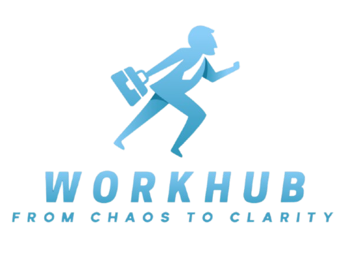
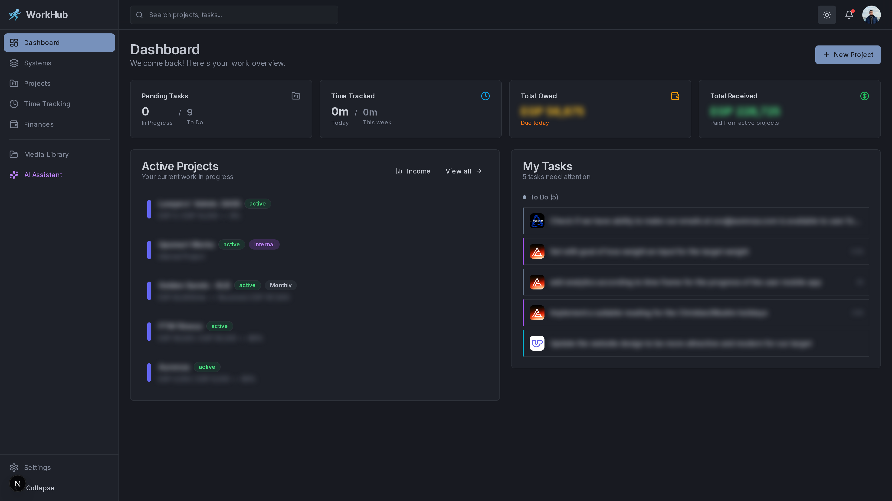
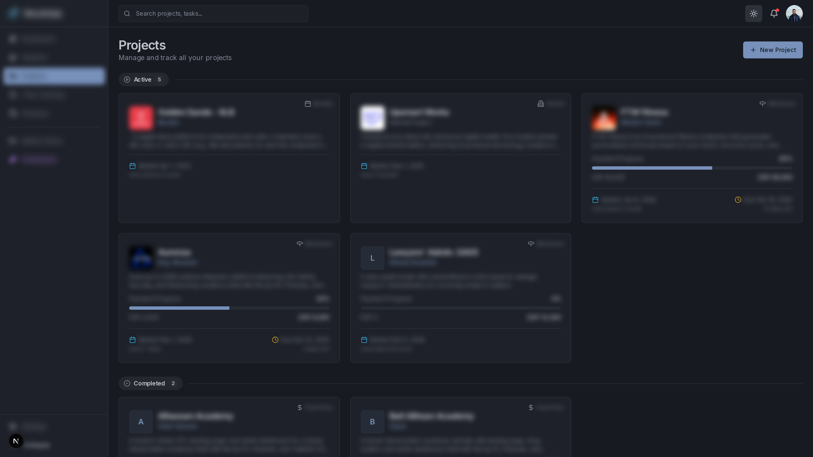
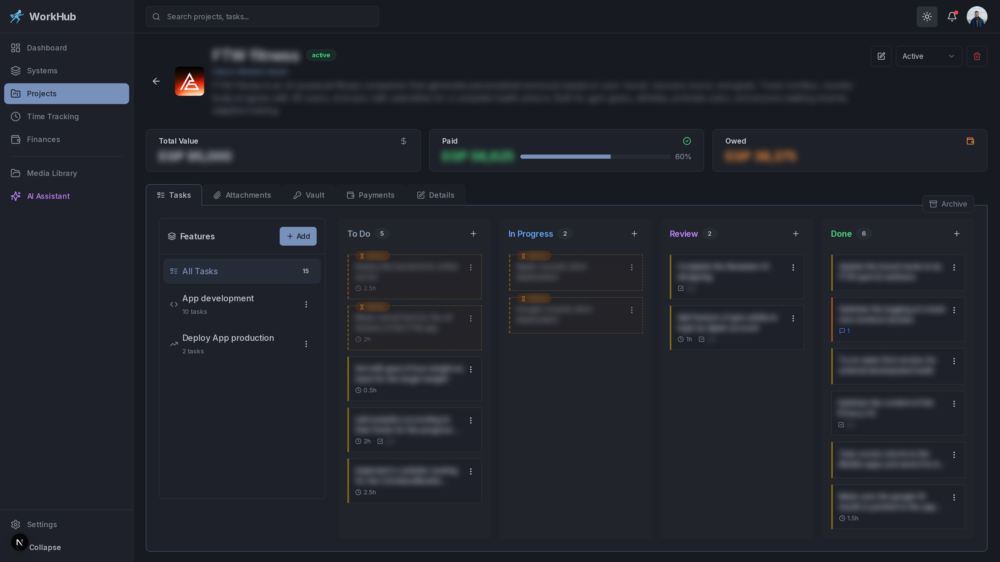
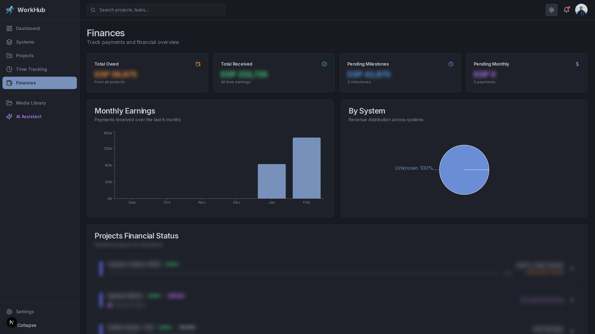
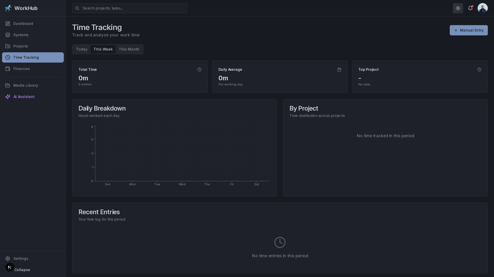
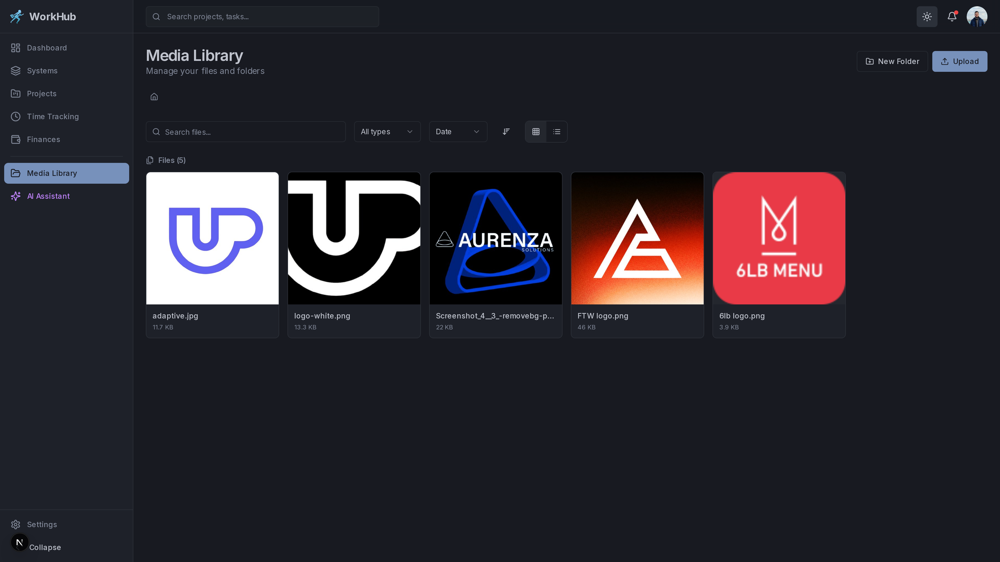
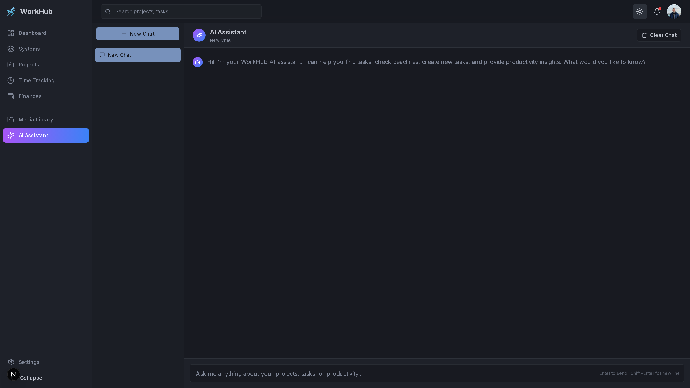

<div align="center">



# WorkHub — Open-Source Project Management for Freelancers

**The all-in-one project management, time tracking, and invoicing platform built for freelancers, agencies, and small teams.**

Stop juggling Trello, Toggl, and spreadsheets. WorkHub combines **Kanban boards**, **time tracking**, **financial management**, **calendar scheduling**, **media library**, and **AI-powered assistance** in a single self-hosted app.

[](LICENSE)
[](https://nextjs.org/)
[](https://www.typescriptlang.org/)
[](https://firebase.google.com/)
[](https://tailwindcss.com/)
[](CONTRIBUTING.md)

[Live Demo](#) &bull; [Getting Started](#-getting-started) &bull; [Features](#-features) &bull; [Screenshots](#-screenshots) &bull; [Docs](#-architecture) &bull; [Contributing](#-contributing)

</div>

---

## Why WorkHub?

| Problem | WorkHub Solution |
|---------|-----------------|
| Kanban boards that lag on 100+ tasks | **Optimistic UI** with instant drag-and-drop — no spinners |
| Time tracking is a separate app | **Built-in live timer** with per-task, per-subtask granularity |
| No idea what clients owe you | **Per-project finances** — milestone, monthly, and fixed-price tracking |
| Scattered files across Google Drive & Dropbox | **Integrated media library** with drag-and-drop upload and image compression |
| AI tools that don't know your project | **Context-aware AI assistant** that understands your tasks, deadlines, and workload |
| SaaS tools that own your data | **Self-hosted on Firebase** — your data stays on your infrastructure |

---

## Screenshots

> All screenshots show the built-in **dark mode**. Light mode is fully supported.

<details open>
<summary><strong>Dashboard</strong> — Your command center</summary>
<p align="center">
  
</p>
Active projects, pending tasks, time tracked today/this week, and financial overview — all at a glance.
</details>

<details>
<summary><strong>Projects</strong> — Rich project cards with progress tracking</summary>
<p align="center">
  
</p>
Manage all projects with rich cards showing progress bars, payment models, deadlines, sub-projects, and client info.
</details>

<details>
<summary><strong>Kanban Board</strong> — Drag-and-drop task management</summary>
<p align="center">
  
</p>
Color-coded priorities, task types, time estimates, feature grouping, and confetti celebrations when tasks hit Done.
</details>

<details>
<summary><strong>Financial Management</strong> — Know what you're owed</summary>
<p align="center">
  
</p>
Track payments, milestones, and monthly earnings with interactive charts and per-project financial breakdowns.
</details>

<details>
<summary><strong>Time Tracking</strong> — Analyze your work hours</summary>
<p align="center">
  
</p>
Daily breakdowns, project distribution, and detailed time entry logs with manual entry support.
</details>

<details>
<summary><strong>Media Library</strong> — Organize project files</summary>
<p align="center">
  
</p>
Upload, organize, and link files to projects. Grid/list views, filters, and automatic image optimization.
</details>

<details>
<summary><strong>AI Assistant</strong> — Your intelligent project companion</summary>
<p align="center">
  
</p>
Chat-based AI powered by Google Gemini for task breakdowns, time estimates, and productivity insights.
</details>

---

## Features

### Project Management
- **Multi-tier hierarchy**: Organizations → Systems → Projects → Features → Tasks → Subtasks
- **Kanban board** with drag-and-drop reordering across columns (To Do, In Progress, Review, Done)
- **Sub-projects** with shared or independent finances
- **Task types**: Task, Bug, Feature, Improvement, Documentation, Research — each color-coded
- **Priority levels**: Low, Medium, High, Critical — with visual border indicators
- **Task states**: Archive to declutter, or mark as "Waiting" for blocked tasks
- **Comments** on tasks and subtasks with threaded discussions

### Time Tracking
- **Live timer widget** — start, pause, resume, stop from anywhere in the app
- **Manual time entry** for retroactive logging
- **Per-subtask tracking** linked to projects and tasks
- **Daily/weekly summaries** on the dashboard
- **Persistent timer** across page navigation (Zustand + localStorage)

### Calendar & Scheduling
- **Full calendar view** — month, week, day, and list views
- **Drag-and-drop events** with resize support
- **Category-based color coding** — Work, Meeting, Deadline, Personal, Reminder
- **Status tracking** — To Do, In Progress, Review, Done, Cancelled
- **Mini calendar sidebar** with quick date navigation and filters

### Financial Management
- **Payment models**: Milestone-based, Monthly, Fixed-price, and Internal
- **Milestone tracking** with pending/completed/paid statuses
- **Monthly payment** management with payment history
- **Income visualization** with interactive ApexCharts
- **Dashboard stats**: Total owed, total received, next payment deadline

### Media Library
- **Folder hierarchy** with breadcrumb navigation
- **Drag-and-drop upload** with progress tracking
- **Automatic image compression** via Canvas API (configurable quality/dimensions)
- **File categories**: Images, Videos, Audio, Documents, Archives
- **Link files** to projects and tasks
- **50MB max file size** via Firebase Storage

### Project Vault
- **Encrypted-like storage** for project-specific sensitive data
- **Entry types**: Text notes, Passwords, and Files
- **Passkey protection** with auto-unlock on correct entry
- **Per-project isolation** accessible from the project detail view

### AI Assistant
- **Powered by Google Gemini** (4 model options: Gemini 3 Pro/Flash, Gemini 2.5 Pro/Flash)
- **Task breakdown**: Generate subtask suggestions from feature descriptions
- **Time estimation**: AI-powered effort estimates
- **Productivity insights**: Project health and work pattern analysis
- **Web search**: Integrated DuckDuckGo search and URL content fetching
- **Optional** — gracefully disabled without API key

### Notifications
- **Deadline alerts** — configurable days-before warning
- **Payment reminders** for pending invoices
- **Timer reminders** for long-running sessions
- **Break reminders** and idle detection
- **Dismissable** — click "Got it" and it won't appear again

### Additional
- **Dark mode** with full theme support
- **Responsive design** for desktop and tablet
- **URL-based tab navigation** — deep link to any project tab
- **Confetti celebration** when tasks are completed
- **Optimistic UI** — instant feedback on all operations

---

## Tech Stack

| Category | Technology |
|----------|-----------|
| **Framework** | [Next.js 16](https://nextjs.org/) (App Router, Turbopack) |
| **Language** | [TypeScript 5.7](https://www.typescriptlang.org/) (strict mode) |
| **UI** | [React 19](https://react.dev/) + [Radix UI](https://www.radix-ui.com/) + [shadcn/ui](https://ui.shadcn.com/) |
| **Styling** | [Tailwind CSS 3.4](https://tailwindcss.com/) |
| **Icons** | [Lucide React](https://lucide.dev/) + [Remix Icons](https://remixicon.com/) |
| **Charts** | [ApexCharts](https://apexcharts.com/) + [Recharts](https://recharts.org/) |
| **Calendar** | [FullCalendar 6](https://fullcalendar.io/) |
| **Rich Text** | [TipTap](https://tiptap.dev/) |
| **Database** | [Firebase Firestore](https://firebase.google.com/products/firestore) |
| **Auth** | [Firebase Authentication](https://firebase.google.com/products/auth) |
| **Storage** | [Firebase Storage](https://firebase.google.com/products/storage) |
| **State** | [Zustand 5](https://zustand-demo.pmnd.rs/) |
| **AI** | [Google Generative AI](https://ai.google.dev/) (Gemini) |
| **Dates** | [date-fns 4](https://date-fns.org/) |
| **Slider** | [keen-slider](https://keen-slider.io/) |

---

## Getting Started

### Prerequisites

- **Node.js** 18+
- **npm** or **yarn**
- A **Firebase project** with Firestore, Authentication, and Storage enabled
- A **Google AI Studio** API key (optional — for AI features)

### Installation

```bash
git clone https://github.com/AhmedSayedSk/workhub.git
cd workhub
npm install
```

### Environment Variables

```bash
cp .env.local.example .env.local
```

```env
# Firebase Configuration
NEXT_PUBLIC_FIREBASE_API_KEY=your_api_key
NEXT_PUBLIC_FIREBASE_AUTH_DOMAIN=your_project.firebaseapp.com
NEXT_PUBLIC_FIREBASE_PROJECT_ID=your_project_id
NEXT_PUBLIC_FIREBASE_STORAGE_BUCKET=your_project.appspot.com
NEXT_PUBLIC_FIREBASE_MESSAGING_SENDER_ID=your_sender_id
NEXT_PUBLIC_FIREBASE_APP_ID=your_app_id

# Gemini AI (optional)
GEMINI_API_KEY=your_gemini_api_key
```

**Where to get these:**
- **Firebase**: [Firebase Console](https://console.firebase.google.com/) → Project Settings → General → Your Apps
- **Gemini**: [Google AI Studio](https://aistudio.google.com/apikey)

### Firebase Setup

1. Create a Firebase project at [console.firebase.google.com](https://console.firebase.google.com/)
2. Enable **Firestore Database** (production mode)
3. Enable **Authentication** → Email/Password
4. Enable **Storage**
5. Update `.firebaserc` with your project ID
6. Deploy rules:

```bash
npm run firebase:deploy:rules
npm run firebase:deploy:indexes
```

### Run

```bash
npm run dev          # Development → http://localhost:3090
npm run build        # Production build
npm start            # Start production server
```

---

## Available Scripts

| Command | Description |
|---------|-------------|
| `npm run dev` | Development server (port 3090) |
| `npm run build` | Production build |
| `npm start` | Production server |
| `npm run lint` | ESLint checks |
| `npm run migrate` | Run Firestore migrations |
| `npm run firebase:deploy` | Deploy all Firebase configs |
| `npm run firebase:deploy:rules` | Deploy Firestore rules |
| `npm run firebase:deploy:indexes` | Deploy Firestore indexes |

---

## Architecture

### Data Model

```
Organization
  └── System (color-coded project groups)
        └── Project (client, payment model, finances)
              ├── Feature (high-level work items)
              │     └── Task (kanban items with status, type, priority)
              │           ├── Subtask (granular work units)
              │           ├── TaskComment (discussion threads)
              │           └── TimeEntry (tracked work sessions)
              ├── CalendarEvent (scheduled events)
              ├── Milestone (payment milestones)
              ├── MonthlyPayment (recurring payments)
              └── VaultEntry (sensitive project data)

MediaFolder / MediaFile  (global media library, linkable to projects/tasks)
AppSettings              (singleton for AI model configuration)
```

### API Routes

| Endpoint | Method | Description |
|----------|--------|-------------|
| `/api/ai` | `POST` | AI: task breakdown, time estimates, insights, Q&A |
| `/api/ai` | `GET` | Fetch current AI settings |
| `/api/web/search` | `POST` | DuckDuckGo web search |
| `/api/web/fetch` | `POST` | Extract content from URLs |

### Key Design Decisions

- **Optimistic updates** on all CRUD — instant UI with automatic rollback on error
- **Optional flags** (`archived`, `waiting`) are orthogonal to task status
- **Firestore Timestamps** everywhere for consistency
- **Background sync** for calendar events — dialog closes immediately
- **URL-based tab state** for deep linking and refresh persistence

---

## Contributing

Contributions are welcome! Please read our [Contributing Guide](CONTRIBUTING.md) before submitting a PR.

```bash
# Fork, then:
git clone https://github.com/YOUR_USERNAME/workhub.git
cd workhub
npm install
cp .env.local.example .env.local
npm run dev
```

### Areas Where Help is Needed

- **Testing** — Unit and integration tests
- **Accessibility** — Keyboard navigation, screen reader support, ARIA labels
- **Internationalization** — Multi-language support
- **Mobile** — Responsive improvements for phones
- **Performance** — Firestore query optimization, bundle size reduction

---

## License

This project is licensed under the [Sikasio Source Available License](LICENSE).

**Free for personal use.** Commercial use requires a license from Sikasio. See [LICENSE](LICENSE) for full terms.

---

## FAQ

<details>
<summary><strong>Is WorkHub free?</strong></summary>
Yes — free for personal use, learning, and non-commercial projects. Commercial use requires a license from Sikasio.
</details>

<details>
<summary><strong>Can I self-host WorkHub?</strong></summary>
Absolutely. WorkHub is designed to be self-hosted on your own Firebase project. Your data stays yours.
</details>

<details>
<summary><strong>Do I need the AI features?</strong></summary>
No. AI features are optional and gracefully disabled without a Gemini API key. Everything else works perfectly without it.
</details>

<details>
<summary><strong>What's the difference between WorkHub and Jira/Asana/Monday?</strong></summary>
WorkHub is built for small teams and freelancers, not enterprises. It combines project management, time tracking, finances, and AI in one place — no per-seat pricing, no feature-gating, no vendor lock-in.
</details>

---

<div align="center">


**Built by [Sikasio](https://sikasio.com)** — From Chaos to Clarity

[Report Bug](https://github.com/AhmedSayedSk/workhub/issues) &bull; [Request Feature](https://github.com/AhmedSayedSk/workhub/issues) &bull; [Star on GitHub](https://github.com/AhmedSayedSk/workhub)

</div>
